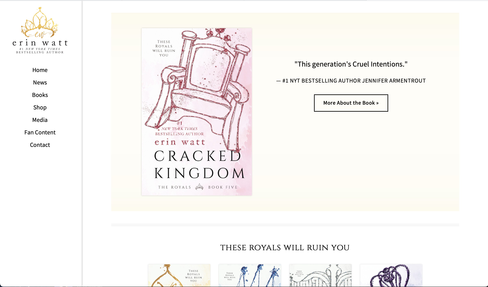
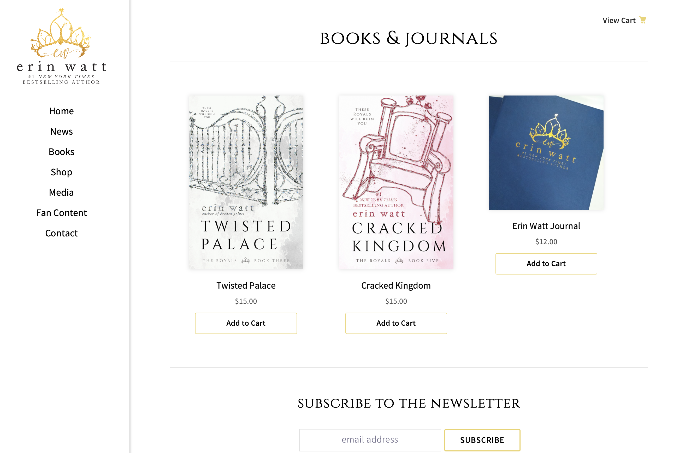
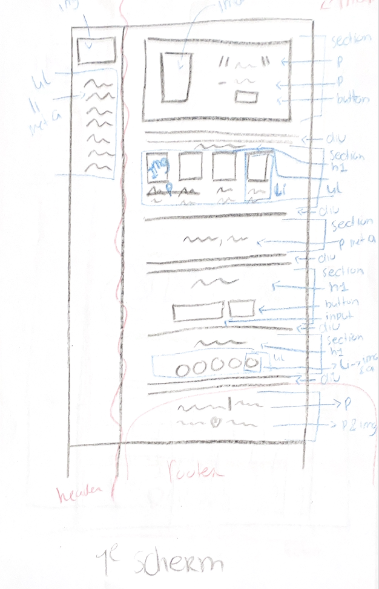
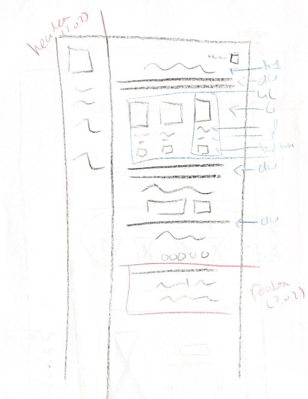
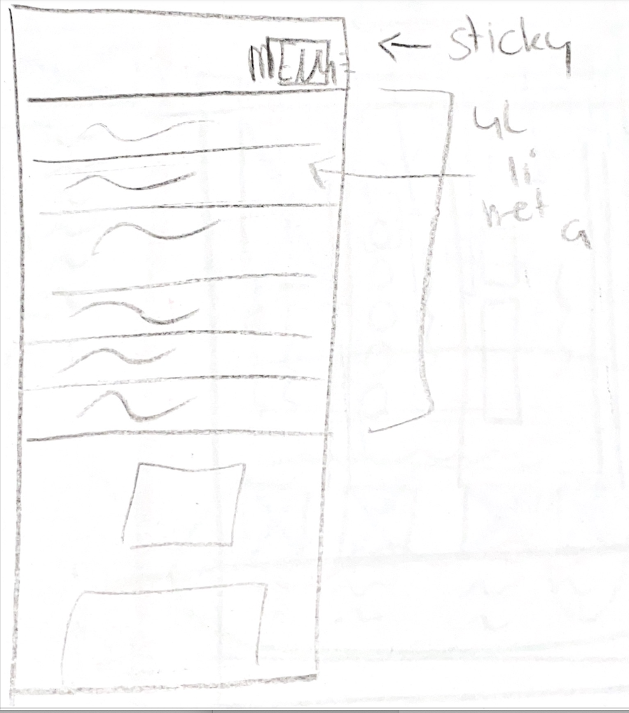

# Procesverslag
Markdown is een simpele manier om HTML te schrijven.  
Markdown cheat cheet: [Hulp bij het schrijven van Markdown](https://github.com/adam-p/markdown-here/wiki/Markdown-Cheatsheet).

Nb. De standaardstructuur en de spartaanse opmaak van de README.md zijn helemaal prima. Het gaat om de inhoud van je procesverslag. Besteedt de tijd voor pracht en praal aan je website.

Nb. Door *open* toe te voegen aan een *details* element kun je deze standaard open zetten. Fijn om dat steeds voor de relevante stuk(ken) te doen.

## Jij

uitwerken voor kick-off werkgroep

### Auteur:
Nina Rijntjes

#### Je startniveau:
blauw

#### Je focus:
surface plane; dit omdat mijn codeer skills niet goed genoeg zijn om responsive te gaan (ik wou responsive eerst doen, maar na 10 minuten coderen was deze droom weg)
 

## Je website

uitwerken voor kick-off werkgroep

### Je opdracht:
https://authorerinwatt.com 
 
#### Screenshot(s) van de eerste pagina (small screen): 
Erin Watt  

#### Screenshot(s) van de tweede pagina (small screen):
hier de naam van de pagina  

 

## Breakdownschets (week 1)

uitwerken na afloop 2e werkgroep

### hoofd pagina op laptop: 

hoofd pagina break down schets 
 vlak voor het inleveren: ik realiseer me nu dat ik de tekst vanaf subscribe allemaal footer had kunnen maken

### SHOP op laptop: 

### MENU TELEFOON: 

## Voortgang 1 (week 2)

uitwerken voor 1e voortgang

### Stand van zaken
ik merk dat ik het erg moeilijk vind en veel tijd heb besteed aan dit project, terwijl dat vgm helemaal niet te zien is.

### Agenda voor meeting
samen met je groepje opstellen

 | Leon           | Denise                   | Lisa                    | Whitney          | Nina
 | ---            | ---                      | ---                     | ---              |
 | Wat wanneer af | hoever je site moet zijn | mee eens met de anderen | heeft niks gezegd| Wat is nu precies de eindopdracht (scherm)
 | en dat ook nog | dit als er tijd is       | nog een punt            | dit wil ik zeker |
 | ...            | ...                      | ...                     | ...              |

### Verslag van meeting
hier na afloop snel de uitkomsten van de meeting vastleggen

 - weten nu hoe ver je moet zijn (ik moet even bijwerken dit weekend)
 - niet responsive, dan hoef je alleen op een klein scherm te werken
 - ik heb weer hoop in dit project
 - duidelijk hoe je kan toepassen
 - ik moet een planning maken

## Voortgang 2 (week 3)

uitwerken voor 2e voortgang

### Stand van zaken
ik was niet bij het gesprek, dit komt omdat ik een begravenis had, vandaar dat dit ook niet ingevuld is. 
 stand van zaken, ik heb te lang aan een menu besteed, zonde van mijn tijd want het was niet goed. Ik heb later die week Bo om hulp gevraagd en toen ging het beter. Ook ben ik verder gaan werken aan het mooi maken van de pagina en een begin gemaakt aan pagina 2.

### Agenda voor meeting
samen met je groepje opstellen

| student 1      | student 2          | student 3    | student 4        |
| ---            | ---                | ---          | ---              |
| dit bespreken  | en dit             | en ik dit    | en dan ik dat    |
| en dat ook nog | dit als er tijd is | nog een punt | dit wil ik zeker |
| ...            | ...                | ...          | ...              |

### Verslag van meeting
nvt
 

## Toegankelijkheidstest (week 4)

uitwerken na test in 8e voortgang

### Bevindingen
- gele blok zelf niet te zien, tekst wel
 - voor kleurenblind is aalles leesbaar
 - menu knop wel erg klein 

#### Gele blok zelf niet te zien, tekst wel

oeps vergeten foto's te maken, maar ik deed de bril op waardoor je geel niet meer ziet, en het viel mij gelijk al op dat het gele blok weg viel. Echter is dit blok niet heel belangrijk, dus heb ik besloten het zo te laten

#### Voor kleurenblind is aalles leesbaar

Ik heb alle kleuren blindheid brillen op gehad en ben de pagina af gegaan, alles was leesbaar, dus hoefte ik hier niks bij aan te passen.

#### Menu knop wel erg klein 

De menu knop was erg klein om te gebruik, dus heb ik deze wat grooter gemaakt 

 
 ik wou nog de test doen met voice assist op mijn telefoon, maar ik kreeg mijn telefoon op een gegeven moment niet meer aan en ben er toen mee gestopt (was erg stressvol)

## Voortgang 3 (week 4)

uitwerken voor 3e voortgang

### Stand van zaken
Ik heb denk ik aardig was process gemaakt en was eigelijk wel zo goed als klaar. Ik moest alleen nog de puntjes op de i zetten

### Agenda voor meeting
samen met je groepje opstellen

| student 1      | student 2          | student 3    | student 4        |
| ---            | ---                | ---          | ---              |
| dit bespreken  | en dit             | en ik dit    | en dan ik dat    |
| en dat ook nog | dit als er tijd is | nog een punt | dit wil ik zeker |
| ...            | ...                | ...          | ...              |

### Verslag van meeting
hier na afloop snel de uitkomsten van de meeting vastleggen

- ken je code
- ik weet nu precies wat en wanneer
- nog een punt
- ...

## Eindgesprek (week 5)

uitwerken voor eindgesprek

### Stand van zaken
waar ik niet uit kwam:
 waar ik erg veel moeite mee had was hte maken van een goed menu. ik merkte dat ik hier ook veel tijd in besteed had. Na een tijdje heb ik Bo gevraagd voor hulp en stuurde zij handige linkjes met uitleg door. Hierdoor was het voor mij weer duidelijk hoe en wat.
 
 lastig:
 ook kwam ik niet uit een paar kleine dingetjes, zoals foto;s 2 aan 2 krijgen wanneer ze in lu staan, dat is uiteindelijk wel gelukt (ook met Bo's hulp)
 
 ging goed:
 na een tijdje vond ik eigelijk alles vanzelf wel beter gaan. Ik snap nu zelfs hoe flexbox werkt (denk ik :) )
 

### Screenshot(s)

 
 
 

## Bronnenlijst

continu bijhouden terwijl je werkt

mijn bronnen staan in de code

